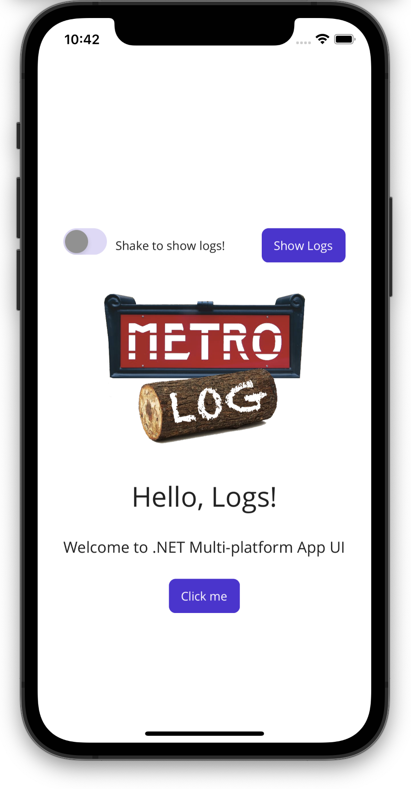
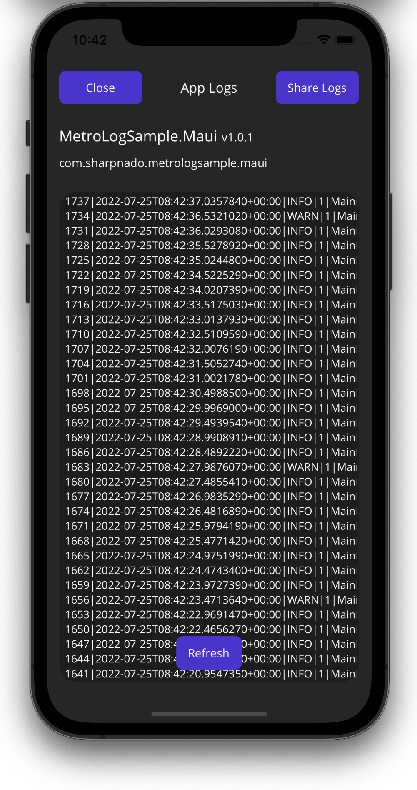
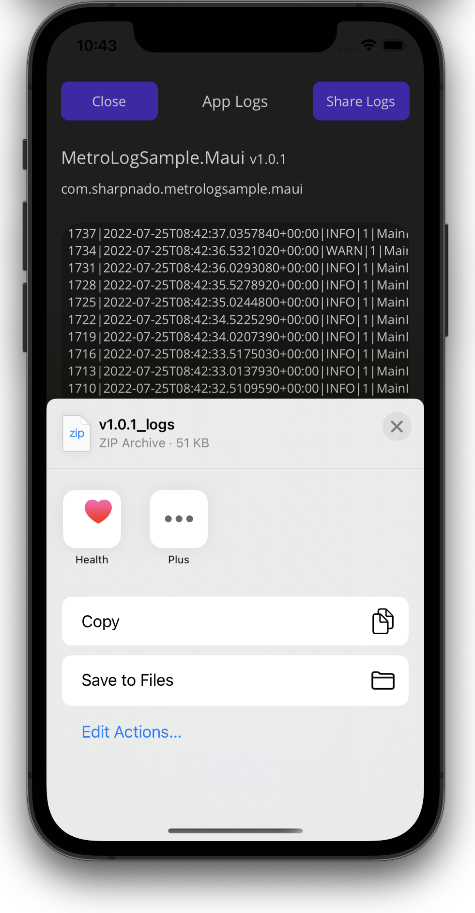

| Platform        | Logo               | Package                                                                                                                          |
|-----------------|--------------------|----------------------------------------------------------------------------------------------------------------------------------|
| `MetroLog.Net6` |       | [](https://www.nuget.org/packages/MetroLog.Net6) |
| `MetroLog.Maui` |  | [](https://www.nuget.org/packages/MetroLog.Maui) |


# Overview

MetroLog.Net6 is a .NET 6 lightweight logging framework designed primarily for mobile platforms like `iOS` and `Android`.

The intention is that MetroLog is mostly compatible with `NLog`. Both the surface area and internal construction
should just about match.

However, to achieve better startup performance, configuration is only possible through code.

# Configuration

Configuration is made through the crossing of a **target** and **log levels**.

A target specify how the logs will be stored. For example, you can use the `DebugTarget` to show your logs in the debug output.
Or you could use the `FileSnapshotTarget` to store your logs in a file.

The log levels describe the level of criticality. You bind each target to a set of log levels.

## Standard configuration

```csharp
    var config = new LoggingConfiguration();

#if RELEASE
    config.AddTarget(
        LogLevel.Info, 
        LogLevel.Fatal, 
        new StreamingFileTarget(retainDays: 2);
#else
    // Will write logs to the Debug output
    config.AddTarget(
        LogLevel.Trace, 
        LogLevel.Fatal, 
        new TraceTarget());
#endif

    // will write logs to the console output (Logcat for android)
    config.AddTarget(
        LogLevel.Info, 
        LogLevel.Fatal, 
        new ConsoleTarget();

    config.AddTarget(
        LogLevel.Info, 
        LogLevel.Fatal, 
        new MemoryTarget(2048);

    LoggerFactory.Initialize(config);
```

If we are in release mode, we store our logs in files for 2 days, only if it falls between `Info`and `Fatal` levels (debug level logs will be discarded).

If we are in debug we just send our logs to the debug output thanks to the trace target.

In both case, we send our logs to a memory buffer so we can display them at any time (through the `LogOperator`).


### Usage

```csharp
public class DownloadService 
{
    private static readonly ILogger Log = LoggerFactory.GetLogger(nameof(DownloadService));
    
    public async Task<File> DowloadAsync()
    {
        Log.Info("DowloadAsync()");
        
        try 
        {
            await _client.GetAsync();
        }
        catch (Exception exception) 
        {
            Log.Error("Oops something bad happened", exception);
        }
    }
}

```

## Microsoft extensions configuration

```csharp
builder.Logging
    .SetMinimumLevel(LogLevel.Trace) // IMPORTANT: set your minimum log level, here Trace
    .AddTraceLogger(
        options =>
        {
            options.MinLevel = LogLevel.Trace;
            options.MaxLevel = LogLevel.Critical;
        }) // Will write to the Debug Output
    .AddConsoleLogger(
        options =>
        {
            options.MinLevel = LogLevel.Information;
            options.MaxLevel = LogLevel.Critical;
        }) // Will write to the Console Output (logcat for android)
    .AddInMemoryLogger(
        options =>
        {
            options.MaxLines = 1024;
            options.MinLevel = LogLevel.Debug;
            options.MaxLevel = LogLevel.Critical;
        })
    .AddStreamingFileLogger(
        options =>
        {
            options.RetainDays = 2;
            options.FolderPath = Path.Combine(
                FileSystem.CacheDirectory,
                "MetroLogs");
        });
```

In this cas we add 4 different targets to our configuration:
* Trace target (`Trace -> Critical`)
* Console target (`Information -> Critical`)
* In memory target (`Debug -> Critical`)
* File target (`Info -> Critical`)

### Usage

```csharp
public class DownloadService 
{
    private readonly ILogger _logger;
    
    public DowloadService(ILogger<DownloadService> logger)
    
    public async Task<File> DowloadAsync()
    {
        _logger.Info("DowloadAsync()");
        
        try 
        {
            await _client.GetAsync();
        }
        catch (Exception exception) 
        {
            _logger.Error("Oops something bad happened", exception);
        }
    }
}

```

We only specify the levels for the in memory logger, it means the other loggers will have the default min/max levels.

Default min level is `Info`, default max level is `Fatal`.

## Change the message template

PR from @SirJohnK.

Since 2.1, you can specify your own message layout.\
Inherit from `Layout` and override `GetFormattedString`:

```csharp
using MetroLog;
using Layout = MetroLog.Layouts.Layout;

namespace MetroLogSample.Maui.Layouts
{
    public class SimpleLayout : Layout
    {
        public override string GetFormattedString(LogWriteContext context, LogEventInfo info)
        {
            return $"{info.TimeStamp:G} - {info.Level}: {info.Message}";
        }
    }
}
```

Then set the `Layout` property from the `LoggerOptions`:

```csharp
builder.Logging
    .AddTraceLogger(
        options =>
        {
            options.MinLevel = LogLevel.Trace;
            options.MaxLevel = LogLevel.Critical;
            options.Layout = new SimpleLayout();
        }) // Will write to the Debug Output
```

## List of targets

* `ConsoleTarget`: log to the Console output (Logcat for android) through `Console.WriteLine`
* `TraceTarget`: log to the Debug output through `Trace.WriteLine`
* `JsonPostTarget`: post your log message to a http endpoint
* `MemoryTarget`: log to a in-memory buffer
* `StreamingFileTarget`: log a to file

## Extensibility

You can of course provide your own `Target` by implementing `SyncTarget` or `AsyncTarget`.

You can even subclass `FileTarget` if you want your own file base target.

Those target can also provide additional features through the subclassing of the `ILogOperator` interface.

# Additional features: LogOperator.Instance

Some targets provide additional features.\
For example the `FileStreamingTarget` allows us to get the logs file as a compressed zip.\
Accessing those capabilities is made possible by the `LogOperator.Instance` singleton.

If your configuration has a file target, you can then retrieve your compressed logs through the log operator:

```csharp
    private void InitializeAppCenter()
    {
#if RELEASE
        Crashes.GetErrorAttachments = report =>
        {
            if (!LogOperatorRetriever.Instance.TryGetOperator<ILogCompressor>(out var logCompressor))
            {
                return;
            }
            var compressedLogs = logCompressor.GetCompressedLogs();

            return new[]
            {
                ErrorAttachmentLog.AttachmentWithBinary(
                    compressedLogs.ToArray(),
                    "logs.zip",
                    "application/x-zip-compressed"),
            };
        };
#endif
    }
```

## List of log operators

### MemoryTarget provides GetLogList

````csharp
public interface ILogLister : ILogOperator
{
    Task<List<string>> GetLogList();
}
````

### StreamingFileTarget provides GetCompressedLogs

````csharp
public interface ILogCompressor : ILogOperator
{
    Task<MemoryStream> GetCompressedLogs();
}
````

# MetroLog.Maui

MetroLog provides a MAUI helper package adding features like:

* Share logs as a zip file
* Displaying logs in a page
* Shake the device to display logs



You can find all the information needed in the `MetroLogSample.Maui` project.

## Maui configuration

```csharp
public static class MauiProgram
{
    public static MauiApp CreateMauiApp()
    {
        var builder = MauiApp.CreateBuilder();
        builder.UseMauiApp<App>()
            .ConfigureFonts(
                fonts =>
                {
                    fonts.AddFont("OpenSans-Regular.ttf", "OpenSansRegular");
                    fonts.AddFont("OpenSans-Semibold.ttf", "OpenSansSemibold");
                });

        builder.Logging
            .AddTraceLogger(
                options =>
                {
                    options.MinLevel = LogLevel.Trace;
                    options.MaxLevel = LogLevel.Critical;
                }) // Will write to the Debug Output
            .AddInMemoryLogger(
                options =>
                {
                    options.MaxLines = 1024;
                    options.MinLevel = LogLevel.Debug;
                    options.MaxLevel = LogLevel.Critical;
                })
            .AddStreamingFileLogger(
                options =>
                {
                    options.RetainDays = 2;
                    options.FolderPath = Path.Combine(
                        FileSystem.CacheDirectory,
                        "MetroLogs");
                });

        builder.Services.AddSingleton(LogOperatorRetriever.Instance);
        builder.Services.AddSingleton<MainPage>();

        return builder.Build();
    }
}
```


## LogController

The package provides a LogController that acts like a view model providing commands and service to a view.

````csharp
public class LogController : INotifyPropertyChanged
{
    public ICommand ToggleShakeCommand { get; }

    public ICommand GoToLogsPageCommand { get; }

    public ICommand ClosePageCommand { get; }

    public bool CanGetCompressedLogs => LogCompressor != null;

    public bool CanGetLogsString => LogLister != null;

    public bool IsShakeEnabled
    {
        get => _isShakeEnabled;
        set
        {
            if (_isShakeEnabled != value)
            {
                ToggleAccelerometer(value);
                _isShakeEnabled = value;
            }

            OnPropertyChanged();
        }
    }

    public static void SuspendShake();

    public static void ResumeShakeIfNeeded();

    public async Task<MemoryStream?> GetCompressedLogs();

    public async Task<List<string>?> GetLogList();
}
````

By setting `IsShakeEnabled` to true, you can display your log page by simply shaking your device.

https://user-images.githubusercontent.com/596903/180782898-98827728-15b0-434d-b5ae-f2bd72b64199.mp4

### Initialization

Because there is so several navigation framework out there, you first need to initialize the `LogController` with the navigation function, and the pop page function.

````csharp
using MetroLog.Maui;

namespace MetroLogSample.Maui;

public partial class App : Application
{
    public App(MainPage mainPage)
    {
        InitializeComponent();

        MainPage = new NavigationPage(mainPage);

        LogController.InitializeNavigation(
            page => MainPage!.Navigation.PushModalAsync(page),
            () => MainPage!.Navigation.PopModalAsync());
    }
}
````

The third parameter is the page factory returning the log page you want to display when are calling the `GoToLogsPageCommand`.

By default, it's the `MetroLogPage`.

## MetroLogPage

The package provides a default log page bound to the `LogController`.

This page displays the logs, and give the possibility to share your logs as a zip and refresh them.





**WARNING**

* you need to add the `MemoryTarget` if you want to display the logs.
* you need to add the `StreamingFileTarget` if you want to share the logs.

### Customization

You can customize some page colors by settings those resource key to the desired color:

````csharp
public static class LogPageResources
{
    public const string LogPageBackgroundColor = nameof(LogPageBackgroundColor);
    public const string LogPageTextColor = nameof(LogPageTextColor);
    public const string LogPageButtonColor = nameof(LogPageButtonColor);
    public const string LogPageFontFamily = nameof(LogPageFontFamily);
    public const string LogPageLogsBorderColor = nameof(LogPageLogsBorderColor);
    public const string LogPageLogsBackgroundColor = nameof(LogPageLogsBackgroundColor);
}
````

```xml
<?xml version="1.0" encoding="UTF-8"?>

<Application xmlns="http://schemas.microsoft.com/dotnet/2021/maui"
             xmlns:x="http://schemas.microsoft.com/winfx/2009/xaml"
             x:Class="MetroLogSample.Maui.App">
    <Application.Resources>
        <ResourceDictionary>
            <ResourceDictionary.MergedDictionaries>
                <ResourceDictionary>
                    <Color x:Key="LogPageBackgroundColor">#262626</Color>
                    <Color x:Key="LogPageLogsBackgroundColor">#1D1D1D</Color>
                    <Color x:Key="LogPageLogsBorderColor">#1D1D1D</Color>
                    <Color x:Key="LogPageTextColor">White</Color>
                </ResourceDictionary>
                <ResourceDictionary Source="Resources/Styles/Colors.xaml" />
                <ResourceDictionary Source="Resources/Styles/Styles.xaml" />
            </ResourceDictionary.MergedDictionaries>
        </ResourceDictionary>
    </Application.Resources>
</Application>

```

# Meta

This is a fork/reboot of the MetroLog library created by Claire Novotny.

This is an open source project that welcomes contributions/suggestions/bug reports from those who use it.
If you have any ideas on how to improve the library, please contact [@piskariov](https://twitter.com/piskariov).

MetroLog is distributed under the MIT license.
